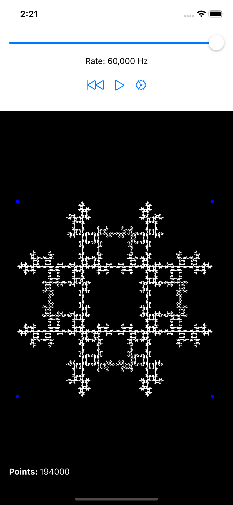
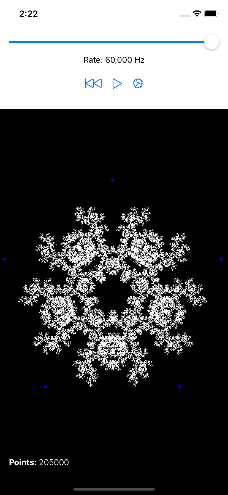

# The Chaos Game

This is a simple iOS app that generates points for the [Chaos Game][ChaosGame]. It’s mostly just
a toy app that I built to explore the math, but feel free to use it as an example.

  - Implements the very simple mathematics of Chaos Game in Swift.
  - Uses SwiftUI with Combine to implement the user interface.
  - Draws many hundreds of thousands of points in a SceneKit view with good performance.

## Cool Fractals I’ve Found:

Here’s a small selection of cool patterns I’ve found by playing with the Chaos Game parameters.
This is by no means a complete list. Play with it and see what you can discover!

| Vertices | Distance Factor | Vertex Selection Strategy | Notes               |
|----------|-----------------|---------------------------|---------------------|
| 3        | 0.5             | Random                    | Sierpinski Triangle |
| 3        | 0.333333        | Not One Place Away        |                     |
| 4        | 0.5             | Non-Repeating             |                     |
| 4        | 0.5             | Not One Place Away        | Ninja Star          |
| 4        | 0.5             | Not Two Places Away       |                     |
| 4        | 0.5             | Not Adjacent              |                     |
| 5        | 0.5             | Non-Repeating             |                     |
| 5        | 0.525           | Not One Place Away        |                     |
| 5        | 0.55            | Not Adjacent              |                     |
| 6        | 0.583333        | Non-Repeating             |                     |
| 6        | 0.666667        | Random                    |                     |

## Screenshots

## License

All code is licensed under the MIT license. Do with it as you will.

[ChaosGame]: https://en.wikipedia.org/wiki/Chaos_game
